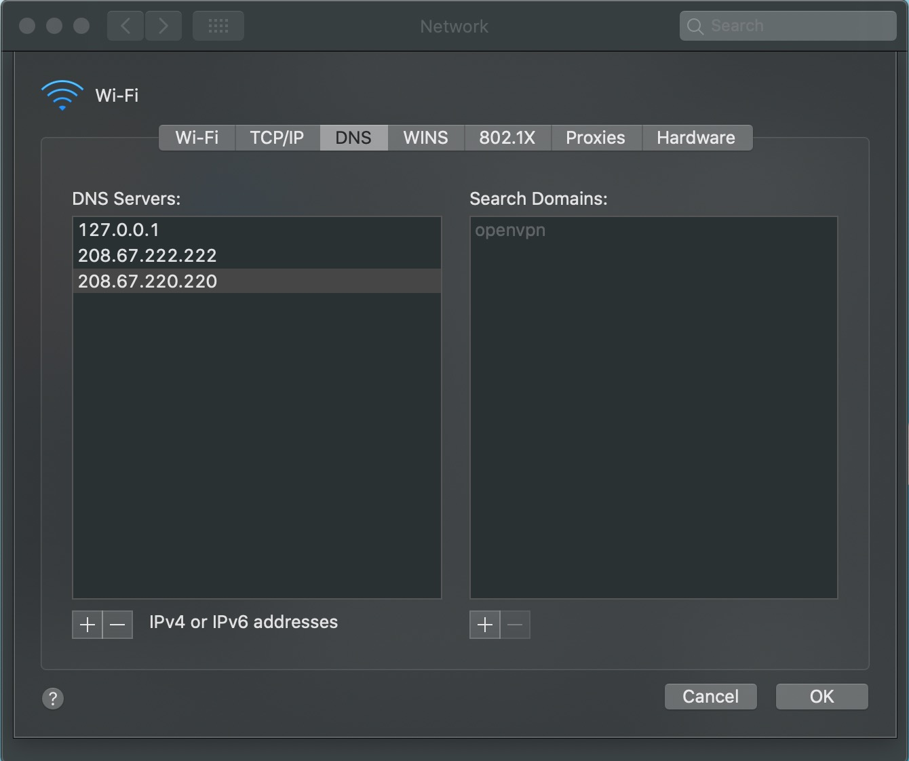
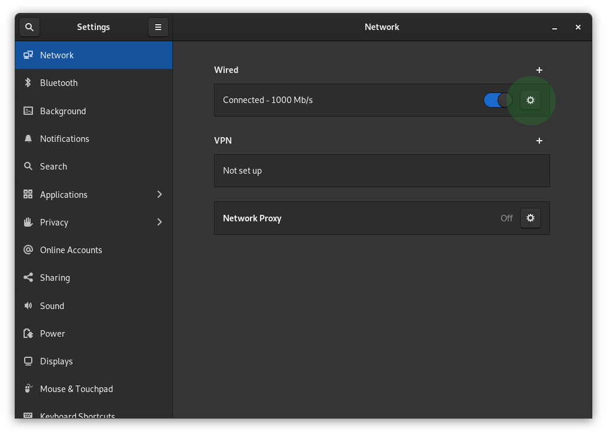
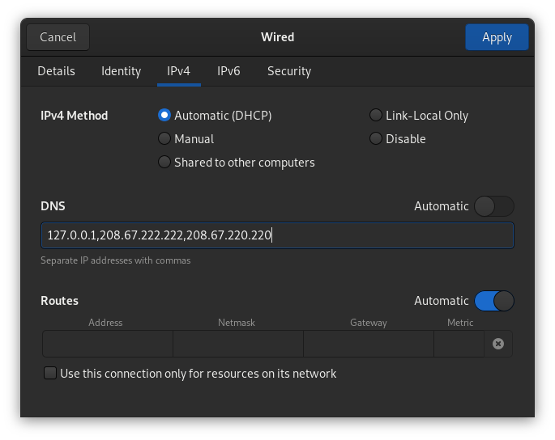
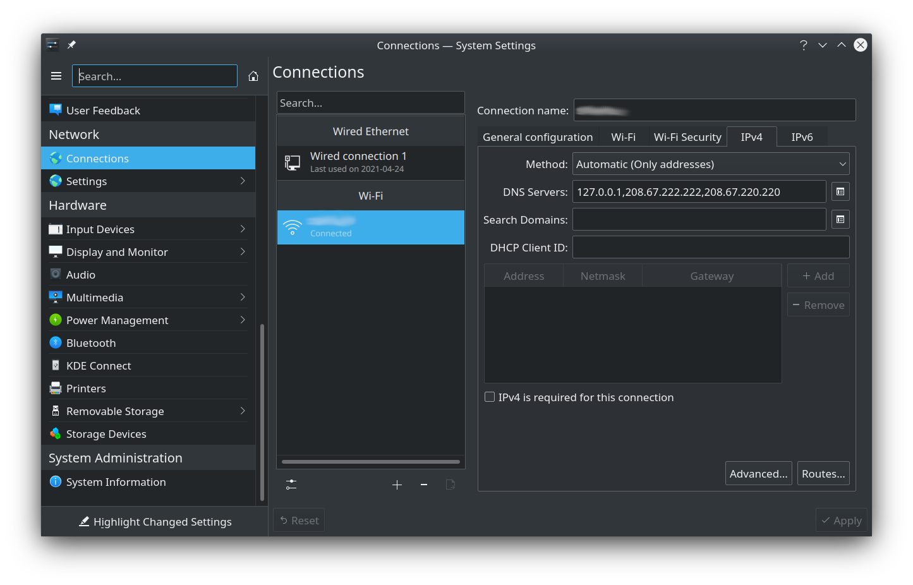

# Maza ad blocking

## 🥇 Top 1 in Hacker News

Comments: https://news.ycombinator.com/item?id=22717650


## A command to squash all ads in all browsers

```shell
sudo maza start
```

Like Pi-hole but local and using your operating system.

Simple, native and efficient **local ad blocker**. Bash script compatible with **MacOS**, **Linux**, **BSD** and **Windows Subsystem for Linux (WSL)**.

- Just **bash** 🤖.
- It affects **any browser** or software installed 😱.
- You **don't have to install any browser extensions or applications** 🚫, you just use the tools of your operating system.
- You update the list of DNS to be blocked with a **single command** 😎.
- Pure **Opensource** ❤️.


## Index

- [Commands](#-commands)
- [Install or update](#%EF%B8%8F-install-or-update)
- [Check if you block ads](#-check-if-you-block-ads)
- [Auto update of domains to be blocked](#-auto-update-of-domains-to-be-blocked)
- [Uninstall](#-uninstall)
- [Not blocking certain domains](#-not-blocking-certain-domains)
- [Add custom domains to block](#-add-custom-domains-to-block)
- [Alternative DNS list](#-alternative-dns-list)
- [DNSMASQ (or support sub-domains: wildcards)](#dnsmasq)
  - [Create your own Pi-Hole](#-create-your-own-pi-hole-server-with-maza)
- [Projects inspired by Maza](#user-content-️-projects-inspired-by-maza)
- [Donations](#-buy-me-a-coffee)
- [Community or questions](#-get-help-or-talk-with-the-community)

## 📟 Commands

### 📡 Update database

``` bash
sudo maza update
```

### 🔨 Start

``` bash
sudo maza start
```

### 🛠 Stop

``` bash
sudo maza stop
```

### ⚖️ Status

``` bash
sudo maza status
```

## ⚙️ Install or Update

### 😥 Requirements

- **bash** 4.0 or higher
- **curl**
- Only macOS users, **gsed**: `brew install gnu-sed`

Then you do this.

``` bash
curl -o maza https://raw.githubusercontent.com/tanrax/maza-ad-blocking/master/maza && sudo rm -rf /usr/local/bin/maza && chmod +x maza && sudo mv maza /usr/local/bin
```

Optional but recommended, make a backup of your hosts file.

``` bash
sudo cp /etc/hosts /etc/hosts.backup
```

## 🧪 Check if you block ads

You can run a test to see if the domains are blocked.

For example, you can run the following command.

``` bash
curl googleadservices.com
```

If you get an error like this, it means that the domain is blocked.

``` shell
curl: (7) Failed to connect to googleadservices.com port 80 after 2 ms: Could not connect to server
```

But if you get a response with HTML, it means that the domain is not blocked (maybe a 404 error).


## 🤖 Auto update of domains to be blocked

Open your `cron`.

``` bash
sudo crontab -e
```

Add the following line at the end.

```
@daily maza update
```

**Note for macOS users:** Cron runs with a minimal environment. You need to set the PATH to include all required binaries and `TERM=dumb` to prevent color output errors:

```
PATH=/bin:/usr/bin:/usr/local/bin:/opt/homebrew/bin
TERM=dumb
@daily maza update
```

The PATH includes:
- `/bin` - bash
- `/usr/bin` - env
- `/usr/local/bin` - maza
- `/opt/homebrew/bin` - gsed (Apple Silicon) or adjust for Intel Macs if needed

## 🔪 Uninstall

``` bash
sudo rm /usr/local/bin/maza && sudo rm -r /root/.config/maza
```

## 🚫 Not blocking certain domains

Edit `/root/.config/maza/ignore` and add the domains you want to ignore.

Example:

``` txt
ads-twitter.com
ads.twitter.com
```

By default, the following domains are ignored to avoid problems with the operating system.

``` txt
localhost
localhost.localdomain
local
broadcasthost
ip6-localhost
ip6-loopback
ip6-localnet
ip6-mcastprefix
ip6-allnodes
ip6-allrouters
ip6-allhosts
0.0.0.0
```

Finally update Maza to apply the changes.

``` bash
sudo maza update
```

## 🎯 Add custom domains to block

If you want to include your own domains to be blocked, you can add them to `/root/.config/maza/custom-domains`. They must each be on one line, ignoring end slash or protocol (`http` or `https`).

For example:

``` txt
beauty-tea.com
www.expaqua.cloud
ad.about.com
```

Then update the database to regenerate the list to include your domains.

```
sudo maza update
```

## 🔒 Alternative DNS list

By default the Yoyo (Peter Lowe) DNS list is used (3.7k blocked domains). If you want to use another list, such as Steven Black's for example (with 135k blocked domains), you must add the URL of your list on line 8.

```
URL_DNS_LIST_CUSTOM="https://raw.githubusercontent.com/StevenBlack/hosts/master/hosts"
```

## DNSMASQ

Unfortunately the hosts file does **not support sub-domains (wildcards)**, which is necessary to correctly filter all DNS. You will **need to install locally a server** for that purpose, Maza supports the **Dnsmasq** format.

[MacOS](#MacOS)

[Linux](#user-content-linux-debianubuntu)

### MacOS

#### 0 Update Maza

```bash
sudo maza update
```

#### 1 Install

```bash
brew install dnsmasq
```

#### 2 Configure

Edit the file.

```
/usr/local/etc/dnsmasq.conf
```

Add the following line at the end.

```
conf-file=(your user path)/.config/maza/dnsmasq.conf
```

Example

```
conf-file=/Users/myuser/.config/maza/dnsmasq.conf
```

Start DNSMASQ.

```bash
sudo brew services stop dnsmasq
sudo brew services start dnsmasq
```

#### 3 Tell your OS to use your DNS server

Delete the list of macOS DNS servers and add the 3 addresses. The first one will be your local server, and the other 2 belong to OpenDNS, which you can use any other.

```bash
127.0.0.1
208.67.222.222
208.67.220.220
```



Refresh your DNS cache

```bash
sudo dscacheutil -flushcache; sudo killall -HUP mDNSResponder
```

#### 4 Restart/Start Maza

```bash
sudo maza stop
sudo maza start
```

### Linux (Debian/Ubuntu)

#### 0 Update Maza

```bash
sudo maza update
```

#### 1 Install

```bash
sudo apt update
sudo apt install dnsmasq
```

#### 2 Configure

Edit file in path.

```
/etc/dnsmasq.conf
```

Add the following line at the end.

```
conf-file=(your user path)/.config/maza/dnsmasq.conf
```

Example

```
conf-file=/home/myuser/.config/maza/dnsmasq.conf
```

Start DNSMASQ.

```bash
sudo systemctl stop dnsmasq
sudo systemctl start dnsmasq
sudo systemctl enable dnsmasq
```

#### 3 Tell your OS to use your DNS server

##### 3.1 Gnome Shell

In Gnome Shell, open `Settings->Network`. Click in your connection.



Add your local server (dnsmasq), and the other 2 belong to OpenDNS, which you can use any other.

```bash
127.0.0.1,208.67.222.222,208.67.220.220
```



##### 3.2 KDE Plasma

In KDE Plasma, open `Settings->Network->Connectios`. Click in your connection and tab `ip4`.

- `Method`: Automatic (Only addresses).

Add your local server (dnsmasq), and the other 2 belong to OpenDNS, which you can use any other.

- `DNS Servers`: `127.0.0.1,208.67.222.222,208.67.220.220`.



#### 4 Restart/Start Maza

```bash
sudo maza stop
sudo maza start
```

### Bonus: dnsmasq is in charge of solving all DNS

Add in configure file: `/usr/local/etc/dnsmasq.conf`

```
no-resolv
server=208.67.222.222
server=208.67.220.220
```

### Bonus: dnsmasq have `localhost` domains

If you want all your `.localhost` domains, for example, point to localhost add in configure file: `/usr/local/etc/dnsmasq.conf` or `/etc/dnsmasq.conf`.

```
address=/.localhost/127.0.0.1
```

## 💬 Get Help or talk with the community

- [IRC: #maza-ad-blocking on irc.libera.chat](ircs://irc.libera.chat:6697/maza-ad-blocking)
- [Fediverse/Mastodon](https://activity.andros.dev/@andros)

## 🍓 CREATE YOUR OWN PI-HOLE SERVER WITH MAZA

You can easily create your own DNS server on a Raspberry Pi, VPS or wherever you want, to connect your devices in just 10 commands thanks to Maza. Follow the [tutorial](https://andros.dev/blog/e4d3b7de/create-your-own-pi-hole-in-10-commands/).

## 🎖️ Projects inspired by Maza

- [adless](https://github.com/WIttyJudge/adless)

## ⚠️ CAUTION

Remember to make a backup copy of `/etc/hosts` in case of unforeseen circumstances, neither the project nor its author will be responsible for any possible repercussions derived from not carrying out this action.

## 🧑‍🎨 Credits

<a target="_blank" href="https://andros.dev/">Andros Fenollosa</a>
